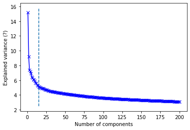
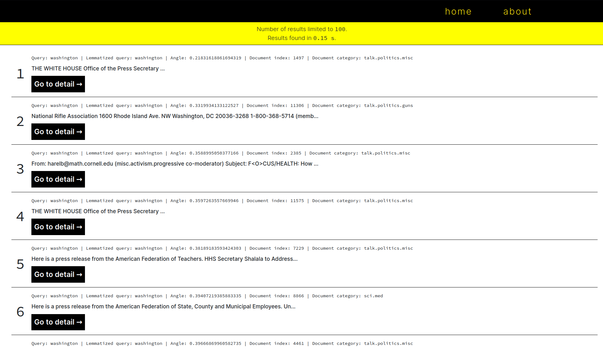
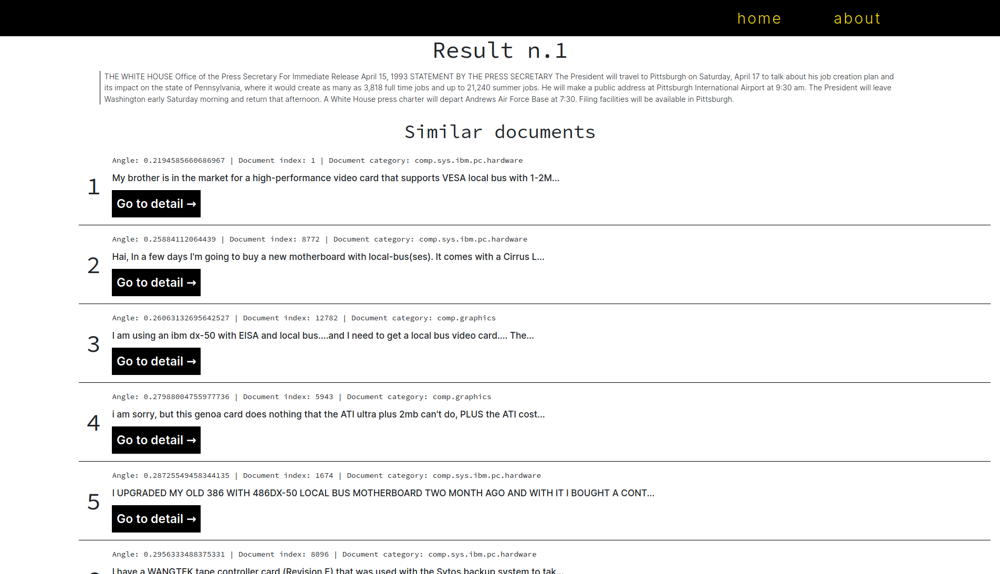

# LSI Vektorový model

## Popis projektu
Cílem našeho projektu bylo vytvořit webovou aplikaci, která by implementovala LSI vektorový model k vyhledávání nad kolekcí textových dokumentů. 

Vstupem do vyhledávacího formuláře je textový dotaz uživatele, podobně jako u klasických webových vyhledávačů, a hodnota přepínače, která určuje, zda bude vyhledáváno v kolekci sekvenčně, nebo optimalizovaně pomocí LSI vektorového modelu.

Výstupem aplikace je seřazený seznam náhledů dokumentů z kolekce, které nejpřesněji odpovídají zadanému dotazu. Daný náhled je možno rozkliknout a přečíst v plném rozsahu.

## Způsob řešení
### Data
Za zdroj textových dat jsme si vybrali dataset
[20 newsgroups](http://qwone.com/~jason/20Newsgroups/).
Vstupem z tohoto datasetu je tedy kolekce cca. 20 tisíc textových dokumentů rozdělených téměř rovnoměrně do 20 kategorií. Tento dataset stahujeme přímo pomocí
[knihovní funkce](https://scikit-learn.org/stable/modules/generated/sklearn.datasets.fetch_20newsgroups.html) 
v scikit-learn.

### Čištění dat
Textová data mohou obsahovat nežádoucí ruch, proto bylo potřeba je pročistit. S dokumenty postupně provádíme tyto úpravy:
1. všechna písmena převedeme na písmena malá
2. odstraníme e-mailové adresy
3. odstraníme non-alfabetické znaky
4. lematizujeme slova
5. odstraníme krátká slova

### Vytvoření vyhledávacího modelu
Nejprve si vyrobíme term-by-document matici o rozměrech (<počet dokumentů>, <počet termů>).
Hodnoty v ní převážíme pomocí tf-idf schématu.

Tuto matici dekomponujeme pomocí singular-value-decomposition (SVD) na matice:
* **u**
    * rozměry: (<počet dokumentů>, <k = počet konceptů>)
    * concept-by-document matice
* **s**
    * rozměry: (<n = počet konceptů>, )
    * vektor konceptů
* **vt**
    * rozměry: (<k = počet konceptů>, <počet termů>)
    * koncept-by-term matice

### Hledání optimálního počtu konceptů
Naším cílem bylo najití optimálního počtu k konceptů tak, aby k bylo co nejnižší (kvůli rychlosti vyhledávání) a zároveň výsledky co nejpřesnější.

*Na ose x je vynešen počet konceptů, na ose y hodnoty singular values tedy "důležitost" konceptů. Křivka se lomí v bodě x=15*

### Zobrazení dotazu do prostoru konceptů
Dále je zapotřebí zobrazit lematizovaný dotaz uživatele do prostoru konceptů jako vektor, následně změřit kosinovou vzdálenost v tohoto vektoru od ostatních vektorů dokumentů.

## Implementace

### Jazyk
K vývoji jsme použili programovací jazyk [Python](https://www.python.org/) 
a mikro webový framework [Flask](https://flask.palletsprojects.com/en/1.1.x/).

### Knihovny
* [Pandas](https://pandas.pydata.org/) k analýze a zpracování dat
* [Numpy](https://numpy.org/) a [Scipy](https://www.scipy.org/) k práci s maticemi
* [NLTK](https://www.nltk.org/) k analýze přirozeného jazyka
* [scikit-learn](https://scikit-learn.org/stable/) k vytváření LSI modelu
* [Kneed](https://kneed.readthedocs.io/en/stable/) k hledání zlomů v křivce optimálního počtu konceptů

Při testování našich nápadů jsme využili [Jupyter notebook](../logic/logic.ipynb).

Celá aplikace je kontejnerizovaná v [Dockeru](https://www.docker.com/).

### Stavba aplikace
Veškerá logika aplikace se nachází v modulu
[lsiModel](../lsiModel.py)
respektive ve třídě LSI uvnitř něj. 

Důležité třídní metody:
* prepare
    * pokud není lokálně stažen dataset s dokumenty, stáhne je
    * pročistí dokumenty
    * vytvoří model pro vyhledávání (ten se vytvoří pouze jednou při inicializaci, poté už zůstává uvnitř třídy)

* svd_optimal_k
    * nalezne optimální počet konceptů

* process_query
    * zpracuje dotaz uživatele a promítne jej do prostoru konceptů
    * změří kosinovou podobnost mezi dotazem a dokumenty
    * lematizuje dotaz
    * vrátí list odpovídajících dokumentů k dotazu

* process_query_seq
    * rozdělí uživatelův dotaz na slova
    * pro každé slovo sekvenčně prochází term-document matici a vrací dokumenty, ve kterých se slovo nachází

Třídu je při prvním spuštění třeba inicializovat. Tato operace může trvat 1-2 minuty. Po celou dobu aplikace do konzole vypisuje, co právě dělá.

Když uživatel potvrdí dotaz ve formuláři na hlavní stránce, je tento dotaz předán LSI třídě. Ta dotaz vyhodnotí a vrátí nazpět list výsledných dokumentů. Ty jsi zobrazeny v seznamu výsledků.

## Ukázka vstupu

uživatel zadal vstup "washington" a nevybral možnost vyhledávat sekvenčně

Aplikace vrátila 100 výsledků za 0.15s. 

Každý výsledek má nad sebou popsaný:
* původní dotaz
* lematizovaný dotaz
* úhlovou vzdálenost výslekdu
* index dokumentu
* kategorii dokumentu

V horní části obrazovky je původní text (bez našich úprav) v plném rozsahu.

Pod ním jsou vylistované jemu podobné dokumenty.